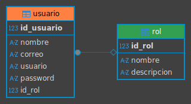
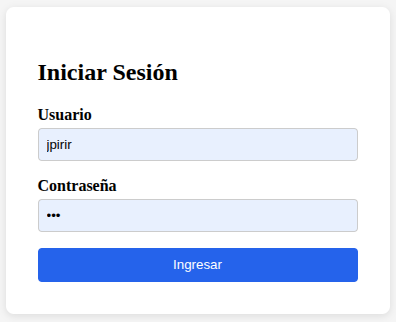
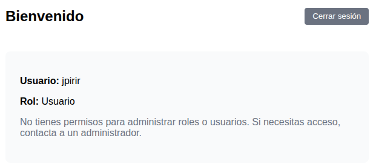
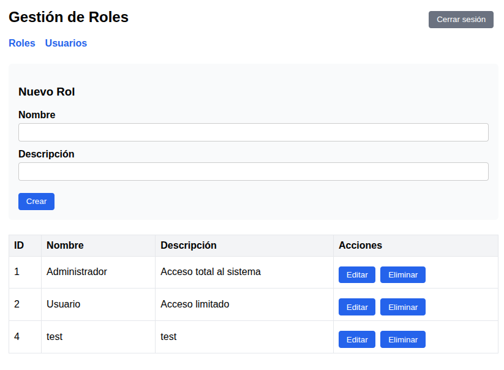
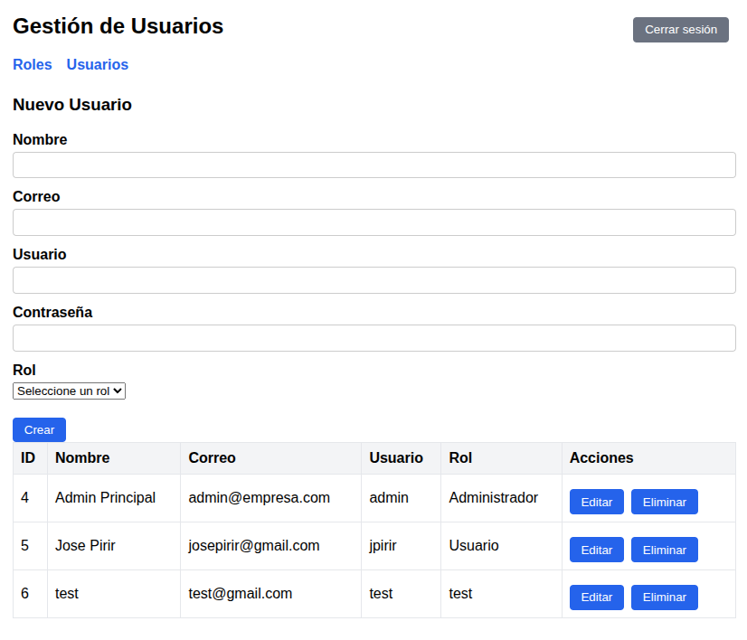
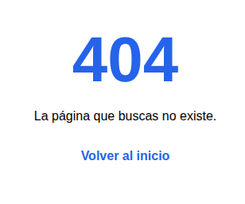

# Documento de Instalación

Examen Práctico - Administración de Usuarios y Roles
Stack: Jakarta EE 10 + Payara Server 6 + MySQL 8 + Angular 16

## Versiones utilizadas

- Payara Server 6.2024.6 (imagen Docker payara/server-full:6.2024.6-jdk17)
- Java 17 (Azul Zulu, viene incluido en la imagen de Payara)
- MySQL 8.0 (imagen Docker mysql:8.0)
- Angular 16
- Node.js 18.x
- Maven 3.x
- Conector JDBC: mysql-connector-j 8.4.0

## Configuración de Payara

Connection Pool:
- Nombre del Pool: examenPool
- Resource Type: javax.sql.DataSource
- Datasource Classname: com.mysql.cj.jdbc.MysqlDataSource
- serverName: mysql-examen (nombre del contenedor de MySQL)
- portNumber: 3306
- databaseName: examen_db
- user: root
- password: admin123
- useSSL: false
- allowPublicKeyRetrieval: true

JDBC Resource:
- JNDI Name: jdbc/examenDS
- Pool Name: examenPool

Persistence Unit (JPA):
- Nombre: examenPU
- Transaction Type: JTA
- JTA Data Source: jdbc/examenDS

## Estructura del proyecto entregado

```
/backend          -> Proyecto Maven (Jakarta EE 10), código fuente completo
/frontend         -> Proyecto Angular 16, código fuente completo
/scripts          -> Script de creación de tablas y datos iniciales (roles)
/documentacion    -> Este documento + diagrama Entidad-Relación
```

## Base de datos

El diagrama Entidad-Relación está en documentacion/images/examen_db.png.

El script scripts/crear_tablas.sql contiene tanto la creación de las tablas
rol y usuario (con su relación de llave foránea) como los datos iniciales
de los roles base (Administrador, Usuario). El usuario administrador no se
inserta ahí, se crea solo al arrancar el backend (ver la sección de
Inicialización automática de datos, más abajo).

## Pasos para ejecutar el proyecto desde cero

Requisitos previos: Docker, Java 17 (JDK), Maven, Node.js 18+ y Angular CLI 16
(`npm install -g @angular/cli@16`).

### 1. Levantar MySQL

```bash
docker run -d --name mysql-examen \
  -e MYSQL_ROOT_PASSWORD=admin123 \
  -e MYSQL_DATABASE=examen_db \
  -p 3306:3306 \
  mysql:8.0
```

Esperar unos segundos a que el contenedor inicie y correr el script de
creación de tablas (está en /scripts):

```bash
docker exec -i mysql-examen mysql -uroot -padmin123 examen_db < scripts/crear_tablas.sql
```

El script solo crea la estructura de tablas y los roles base (Administrador,
Usuario). El usuario administrador no se inserta por SQL, se crea solo al
arrancar el backend (ver más abajo el punto de DataSeeder).

### 2. Levantar Payara

```bash
docker run -d --name payara-examen \
  -p 8080:8080 -p 4848:4848 \
  --link mysql-examen:mysql-examen \
  payara/server-full:6.2024.6-jdk17
```

Esperar 20-30 segundos a que termine de iniciar el dominio.

### 3. Instalar el driver JDBC de MySQL en Payara

```bash
wget https://repo1.maven.org/maven2/com/mysql/mysql-connector-j/8.4.0/mysql-connector-j-8.4.0.jar
docker cp mysql-connector-j-8.4.0.jar payara-examen:/opt/payara/appserver/glassfish/domains/domain1/lib/
docker restart payara-examen
```

### 4. Configurar el Connection Pool y JDBC Resource

Entrar a la consola de administración en https://localhost:4848 (usuario
admin, password admin).

En Resources > JDBC > JDBC Connection Pools > New, crear el pool examenPool
con los datos de la sección anterior. Verificar con el botón Ping que
conecta bien.

Luego en Resources > JDBC > JDBC Resources > New, crear el JNDI Name
jdbc/examenDS asociado al pool examenPool.

### 5. Compilar y desplegar el backend

```bash
cd backend
mvn clean package
```

Crear un archivo de password temporal dentro del contenedor (solo la primera
vez):

```bash
docker exec payara-examen sh -c 'echo "AS_ADMIN_PASSWORD=admin" > /tmp/pwdfile'
```

Desplegar:

```bash
docker cp target/examen-backend.war payara-examen:/tmp/examen-backend.war
docker exec payara-examen /opt/payara/appserver/bin/asadmin \
  --user admin --passwordfile /tmp/pwdfile \
  deploy --contextroot examen-backend /tmp/examen-backend.war
```

Para redeploys posteriores (después de modificar código), incluyo un script
redeploy.sh en /backend que automatiza todo esto: compila, copia el war al
contenedor, hace undeploy y vuelve a desplegar.

### 6. Verificar que el backend responde

```bash
curl http://localhost:8080/examen-backend/api/ping
```

Debería devolver: {"status":"ok","mensaje":"Backend funcionando"}

### 7. Levantar el frontend

```bash
cd frontend
npm install
ng serve
```

Abrir http://localhost:4200

## Credenciales de acceso por defecto

Usuario: admin
Password: admin123
Rol: Administrador

Esta cuenta se crea sola la primera vez que arranca el backend (explico
cómo abajo). El password se guarda hasheado con BCrypt, no en texto plano.

## Inicialización automática de datos

El backend tiene una clase DataSeeder (@Singleton @Startup, en el paquete
com.examen.rest) que corre automáticamente cuando arranca la aplicación.
Revisa si ya existe el usuario admin, y si no existe, crea los roles
Administrador y Usuario (si hace falta) y el usuario admin con su password
ya hasheado.

La idea es que el sistema quede usable desde el primer arranque sin tener
que insertar nada a mano, y sin tener que poner contraseñas en texto plano
en ningún script SQL.

## Funcionalidades adicionales que agregué

Además de lo que pedía el examen, agregué lo siguiente:

Contraseñas encriptadas: uso BCrypt (librería jbcrypt) para hashear y
verificar contraseñas. La clase PasswordUtil centraliza esto.

Autenticación con JWT: el login devuelve un token firmado (HS256, librería
jjwt) que expira en 1 hora. Las rutas /api/roles y /api/usuarios están
protegidas por un filtro que exige y valida ese token, devolviendo 401 si
falta o es inválido. En Angular hay un interceptor que agrega el token
automáticamente a cada petición y redirige a login si recibe un 401.

La clave secreta del JWT está hardcodeada en el código por simplicidad del
examen; en un proyecto real iría en una variable de entorno.

Vista diferenciada por rol: después de iniciar sesión, si el usuario es
Administrador entra al panel de gestión (Roles y Usuarios). Cualquier otro
rol entra a una pantalla aparte, de solo lectura. El acceso a /roles y
/usuarios está protegido por un guard que redirige a cualquier usuario que
no sea Administrador, incluso si intenta entrar escribiendo la URL
directamente. Por ahora esta restricción es solo del lado de Angular, el
backend no valida el rol en cada endpoint, solo valida que el token sea
válido. Quedaría como mejora pendiente.

Página 404: cualquier ruta que no existe muestra una página de error con
link de regreso al login.

## Notas finales

CORS está configurado en el backend para aceptar solo peticiones desde
http://localhost:4200.

El driver JDBC y el connection pool hay que configurarlos a mano la primera
vez que se levanta un contenedor de Payara nuevo. Si el contenedor se borra
hay que repetir esos pasos; si solo se detiene y se vuelve a levantar con
docker start, la configuración se mantiene.

## Imagenes
#### Diagrama Base de Datos


#### Login


#### User


#### Roles


#### Usuarios


#### No encontrado
